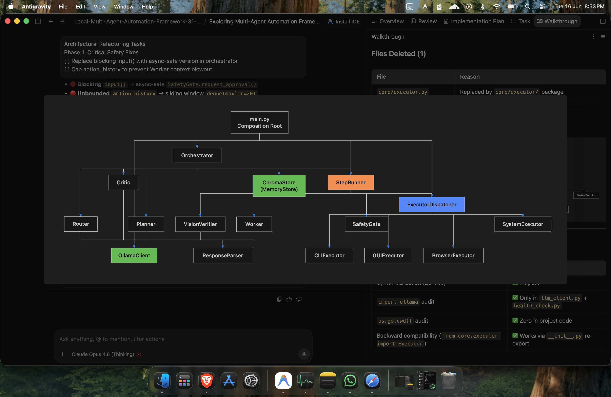

<div align="center">

# 🤖 Local Multi-Agent Automation Framework

*A powerful, privacy-first, autonomous multi-agent framework for OS automation powered by local LLMs.*

[](https://www.python.org/downloads/)
[](https://ollama.com/)
[](LICENSE)
[]()

</div>

---

## ⚡ Overview

Welcome to the **Local Multi-Agent Automation Framework**, an ultra-minimalist, high-performance terminal tool that leverages local AI agents to automate tasks directly on your Operating System. Built entirely around privacy and local execution, this framework requires no cloud API keys and operates fully on your own hardware using Ollama.

<div align="center">
  
</div>

## ✨ Key Features

- 🧠 **Multi-Agent Architecture**: Collaborative agents including a *Manager*, *Worker*, and *Vision* model designed to plan, execute, and verify OS tasks.
- 🔒 **100% Local & Private**: Runs entirely locally via Ollama. No data leaves your machine.
- 👁️ **Computer Vision & UI Interaction**: Built-in screenshot capabilities and UI parsing to understand and interact with your screen using `PyAutoGUI` and `Playwright`.
- 🎙️ **Voice Commands**: Optional voice input support to direct your agent army hands-free.
- 🔄 **Hot-Swappable Models**: Change active agent models on the fly directly from the CLI using `/model` commands.

## 🏗️ Architecture & Workflow

The system is built on a modular, event-driven architecture that allows seamless communication between specialized agents.

<div align="center">
  
</div>

## 🚀 Getting Started

### Prerequisites

- **Python 3.10+**
- **Ollama** installed and running locally
- (Optional) Tesseract OCR for text extraction

### Installation

1. **Clone the repository:**
   ```bash
   git clone https://github.com/Udbhav7002/Local-Multi-Agent-Automation-Framework-with-UI.git
   cd Local-Multi-Agent-Automation-Framework-with-UI
   ```

2. **Set up a virtual environment:**
   ```bash
   python -m venv venv
   source venv/bin/activate  # On Windows use `venv\Scripts\activate`
   ```

3. **Install dependencies:**
   ```bash
   pip install -r requirements.txt
   ```

4. **Pull Local Models (via Ollama):**
   ```bash
   ollama pull qwen2.5-coder:14b  # Or your preferred models
   ```

### 🎮 Usage

Start the main terminal interface:

```bash
python main.py
```

#### CLI Commands

Once inside the terminal interface, you can use the following commands:
- `/model <agent> <model_name>` - Swap models instantly (e.g., `/model manager qwen2.5-coder:14b`)
- `/clear` - Clear the terminal screen
- `/save` - Save current session state
- `/quit` - Exit the framework

## 🛠️ Technology Stack

- **FastAPI / Uvicorn**: API & Service Layer
- **ChromaDB**: Local vector store for agent memory
- **Playwright**: Web automation
- **PyAutoGUI / OpenCV / MSS**: Desktop vision & interaction
- **Rich**: Beautiful CLI rendering

---

<div align="center">
Made with ❤️ by Udbhav7002
</div>